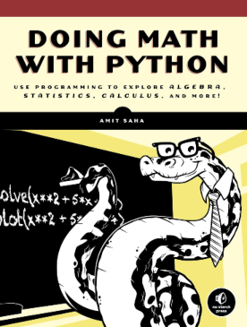

# Amit Saha-Doing Math With Python

## Overview
This repository contains my practises and solutions to challenges discussed in "Doing Math with Python" written by Amit Saha.
You can basically access every directory of this repository and see 2 subdirectories:
- Chapter: code practises proposed in "Doing math with Python" book.
- Programming_challenges: my own solutions of the challenges proposed in "Doing math with Python" book.

## Book Frontpage
